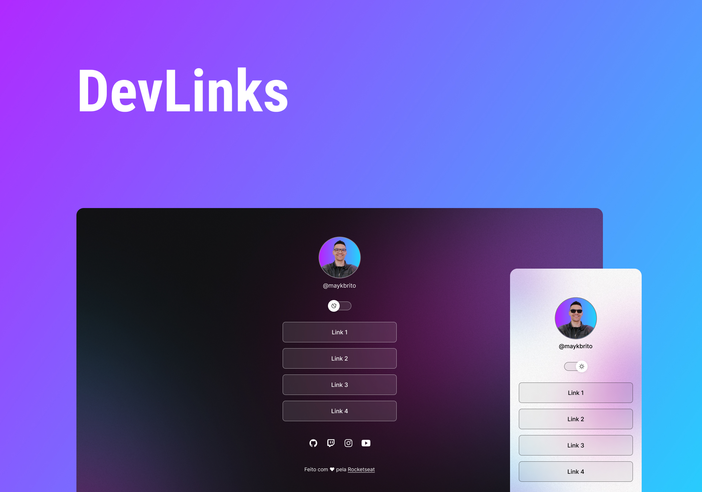

<h1>DevLinks</h1>

Programa exclusivo e gratuito, promovido pela Rocketseat para ensino
 de tecnologias WEB.

Esse projeto foi desenvolvido utilizando as seguintes tecnologias:
- HTML e CSS
- JavaScript
- Git e Github
- Figma

O DevLinks é um agregador de links para usar como cartão de visitas online.

